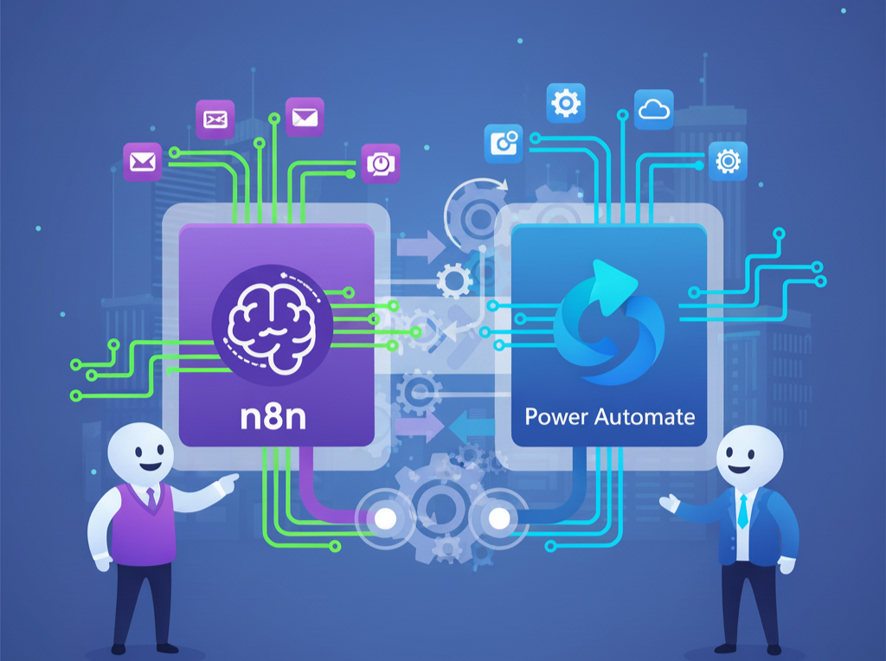

# Hi there 👋, we are CloudUI!

Welcome to the official GitHub organization for CloudUI. We are a team of passionate developers and cloud experts dedicated to helping businesses of all sizes streamline their operations, reduce costs, and improve efficiency through cloud automation.

---

## 🚀 About Us

CloudUI is a leading provider of cloud automation solutions. We help businesses of all sizes streamline their operations, reduce costs, and improve efficiency. Our team of experts has a proven track record of success in delivering innovative and effective solutions. Our mission is to become the leading provider of cloud automation solutions in the region by providing our clients with the best possible service and by continuously innovating and improving our solutions.

---

## 🛠️ Core Services

We offer a wide range of services to help you get the most out of the cloud. Our services include:

- ☁️ **Cloud Consulting:** We help you to choose the right cloud platform and to design a cloud architecture that meets your specific needs.

- 🚚 **Cloud Migration:** We help you to migrate your existing applications and data to the cloud.
- 🤖 **Cloud Automation:** We help you to automate your cloud infrastructure and to use the cloud to automate your business processes.
- 🔌 **n8n and Power Automate Consulting:** We are experts in n8n and Power Automate, and we can help you to use these tools to automate your workflows.

- 🧠 **AI Model Integration:** We can help you to integrate AI models like Gemini and ChatGPT into your applications.

---

## 🎯 Areas of Opportunity

We have experience working with businesses in a variety of industries, including:

- 🛒 **E-commerce:** We can help you to automate your order fulfillment process, to improve your customer service, and to increase your sales.
- 🏥 **Healthcare:** We can help you to automate your patient records system, to improve your appointment scheduling process, and to reduce your costs.
- 💰 **Finance:** We can help you to automate your financial reporting process, to improve your fraud detection system, and to reduce your risks.
- 🏭 **Manufacturing:** We can help you to automate your production process, to improve your supply chain management system, and to reduce your costs.

---

## 📦 Packages

We offer three packages to meet the specific needs of each client:

| Package | Description |
|---|---|
| **Basic** | Cloud consulting and migration. |
| **Standard** | Everything in the Basic package, plus cloud automation. |
| **Premium** | Everything in the Standard package, plus AI model integration. |

---

## 💰 Pricing

Our prices are competitive and tailored to the specific needs of each client. Please contact us for a custom quote.

---

## 🤝 Getting Started

Our onboarding process is simple and straightforward. We will work with you to understand your needs and to develop a custom solution that meets your specific requirements.

---

## 💻 Our Tech Stack

We are experts in a variety of technologies, including:

---

## 📫 Contact Us

Please feel free to contact us if you have any questions or if you would like to learn more about our services.

- 📧 **Email:** [info@cloudui.lat](mailto:info@cloudui.lat)
- 🌐 **Website:** [www.cloudui.lat](https://www.cloudui.lat)

---

Thanks for visiting our profile! We look forward to working with you.